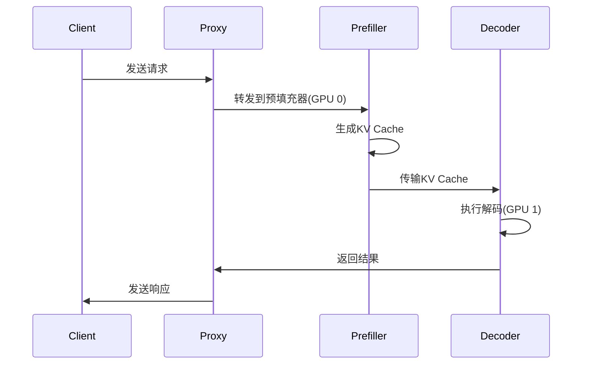

---
status: new
--- 

# vLLM

!!! note "正在施工中👷.. "

[vLLM - vLLM 文档](https://docs.vllm.com.cn/en/latest/index.html)

## 安装

```shell title="安装"
> uv venv --python 3.12 --seed
> source .venv/bin/activate
> uv pip install vllm --torch-backend=auto
```

!!! error "RuntimeError: Failed to find C compiler. Please specify via CC environment variable or set triton.knobs.build.impl."

    ```shell title="linux"
    sudo apt update
    sudo apt install build-essential
    ```

    ```shell
    pip install triton
    ```

## 使用

### logger

```json title="logger"
{
"formatters": {
    "vllm": {
    "class": "vllm.logging_utils.NewLineFormatter",
    "datefmt": "%m-%d %H:%M:%S",
    "format": "%(levelname)s %(asctime)s %(filename)s:%(lineno)d] %(message)s"
    }
},
"handlers": {
    "vllm": {
    "class" : "logging.StreamHandler",
    "formatter": "vllm",
    "level": "DEBUG",
    "stream": "ext://sys.stdout"
    },
    "file": {  
    "class": "logging.FileHandler",
    "formatter": "vllm",
    "level": "DEBUG",
    "filename": "/path/to/debug.log"
    }
},
"loggers": {
    "vllm": {
    "handlers": ["vllm", "file"],
    "level": "DEBUG",
    "propagate": false
    },
    "vllm.example_noisy_logger": {
    "propagate": false
    }
},
"version": 1
}
```

然后运行

```shell
VLLM_LOGGING_CONFIG_PATH=vllm_logging_config.json \
vllm serve /path/to/model
```

## 源码理解

## tricks

### LMcache

[LMCache - vLLM --- LMCache - vLLM](https://docs.vllm.ai/en/stable/examples/others/lmcache.html#1-disaggregated-prefill-in-vllm-v1)



```shell
> uv venv --python 3.12 --seed
> source .venv/bin/activate
> uv pip install vllm --torch-backend=auto
---> 100%
Installed
```

<br>

```shell
> uv pip install lmcache
> uv pip install nixl
> uv pip install vllm
> uv pip install pandas
> uv pip install datasets
```

```shell
cd vllm/examples/others/lmcache/disagg_prefill_lmcache_v1
```

## 案例

### 在线推理

```bash
vllm serve Salesforce/blip2-opt-2.7b \
    --host 0.0.0.0 \
    --port 8080 \
    --dtype auto \
    --max-num-seqs 32 \
    --max-model-len 2048 \
    --tensor-parallel-size 2 \
    --trust-remote-code
```

### 离线推理

```python title="单提示词和多提示词批量推理"
from vllm import LLM, SamplingParams
import PIL


llm = LLM(model="Salesforce/blip2-opt-2.7b")


# 参考 HuggingFace 仓库以使用正确的格式
prompt = "USER: <image>\nWhat is the content of this image?\nASSISTANT:"


# 使用 PIL.Image 加载图像
image = PIL.Image.open("/root/autodl-tmp/dataset/coco-val2017/000000001490.jpg")


# 单提示词推理
outputs = llm.generate({
    "prompt": prompt,
    "multi_modal_data": {"image": image},
})


for o in outputs:
    generated_text = o.outputs[0].text
    print(generated_text)


# 批量推理
image_1 = PIL.Image.open("/root/autodl-tmp/dataset/coco-val2017/000000001490.jpg")
image_2 = PIL.Image.open("/root/autodl-tmp/dataset/coco-val2017/000000581317.jpg")
outputs = llm.generate(
    [
        {
            "prompt": "USER: <image>\nWhat is the content of this image?\nASSISTANT:",
            "multi_modal_data": {"image": image_1},
        },
        {
            "prompt": "USER: <image>\nWhat's the color of this image?\nASSISTANT:",
            "multi_modal_data": {"image": image_2},
        }
    ]
)


for o in outputs:
    generated_text = o.outputs[0].text
    print(generated_text)
```

```python title="Salesforce/blip2-opt-2.7b 离线推理"
import os
import argparse
from PIL import Image
from vllm import LLM, EngineArgs, SamplingParams
from vllm.multimodal.image import convert_image_mode

def run_blip2(questions: list[str], modality: str) -> tuple:
    assert modality == "image"
    
    prompts = [f"Question: {question} Answer:" for question in questions]
    engine_args = EngineArgs(
        model="Salesforce/blip2-opt-2.7b",
        limit_mm_per_prompt={modality: 1},
    )

    return engine_args, prompts

def main():
    parser = argparse.ArgumentParser(
        description="Run BLIP-2 model with custom image and questions"
    )
    parser.add_argument(
        "--image-path",
        type=str,
        required=True,
        help="Path to the input image"
    )
    parser.add_argument(
        "--questions",
        type=str,
        nargs="+",
        required=True,
        help="One or more questions about the image"
    )
    parser.add_argument(
        "--seed",
        type=int,
        default=42,
        help="Random seed"
    )
    args = parser.parse_args()

    # Load and process image
    image = Image.open(args.image_path)
    image = convert_image_mode(image, "RGB")
    
    # Get model configuration
    engine_args, prompts = run_blip2(args.questions, "image")
    engine_args.seed = args.seed

    # Initialize model
    llm = LLM(**vars(engine_args))

    # Set sampling parameters
    sampling_params = SamplingParams(temperature=0.2, max_tokens=64)

    # Prepare input
    inputs = {
        "prompt": prompts[0],
        "multi_modal_data": {"image": image},
    }

    # Generate response
    outputs = llm.generate(inputs, sampling_params=sampling_params)

    # Print results
    print("-" * 50)
    print(f"Image: {args.image_path}")
    print(f"Question: {args.questions[0]}")
    print("Answer:")
    print(outputs[0].outputs[0].text)
    print("-" * 50)

if __name__ == "__main__":
    main()
```

### LMcache 配置

```shell title="tree"
configs/
disagg_proxy_server.py   
disagg_vllm_launcher.sh  
launch.sh 
kill.sh 
```
