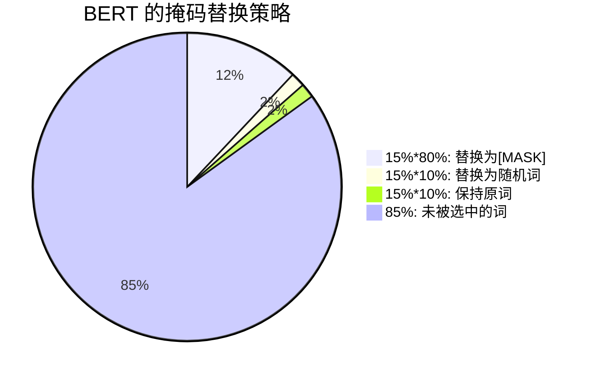

---
status: new
--- 
# 04 | BERT

!!! note "主要介绍一下 encoder-only 技术路线的模型，以 BERT 为主"

Pre-training of Deep Bidirectional Transformers for Language Understanding

<iframe src="https://arxiv.org/pdf/1810.04805" width="100%" height="500px"></iframe>

## 核心思想

在一个很大的数据集上训练好一个很宽很深的模型，在很多小的问题上可以通过微调来全面提升小数据的性能（在计算机视觉领域用了很多年），模型越大，效果越好（很简单很暴力）。

在计算机视觉领域，在'大量的'没有标签的数据集上做训练比在'少量的'有标签的数据集上做训练效果会更好

## 背景

BERT 的名字来自于"Bidirectional Encoder Representations for Transformer"。

当时，将预训练模型应用在下游任务通常有两种做法

- 基于特征的：ELMo 双向的信息，网络架构比较老，用的是 RNN
- 基于微调的：GPT：transformer 想法，但是是单向的，没有双向的信息

这两个途径都是使用相同的目标函数，都是用一个单向的语言模型（说一句话，预测下一句话）。


而 BERT 是 Transformer，所以对于下游任务不需要做那么多的调整。

现在的技术的问题是语言模型是单向的，如果要做句子层面的分析的话，如果从左看到右外，还可以从右看到左，是可以提升性能的。

在大量的没有标注的数据上，预训练一个语言模型，然后迁移到其他任务上的效果，有可能比在有标注的数据上训练的模型效果还要好。

**那么如何让语言模型变成双向的呢？**

带掩码的语言模型随机挖去一些字元，然后允许看左右信息，并进去填空，也就是完形填空。另一个是下一句预测，随机采样两个句子，判断这两个句子是否是相邻的。这两个任务解决了“双向”的问题。

Bert 有两个步骤：pre-training + fine-tuning

**Pre-training 预训练：**

在预训练阶段，BERT 用大量的无监督文本通过自监督训练的方式 (通过使用受完形填空任务启发的 Masked Language Model 预训练目标) 训练，把文本中包含的语言知识（包括：词法、语法、语义等特征）以参数的形式编码 Transformer-encoder layer 中。预训练模型学习到的是文本的通用知识，不依托于某一项 NLP 任务；

对比 ELMo，虽然都是“双向”,但目标函数其实是不同的。ELMo 是分别以$P(w_i|w_1,\ldots w_{i-1})$ 和$P(w_i|w_{i+1},\ldots w_n)$作为目标函数，独立训练处两个 representation 然后拼接，而 BERT 则是以$P(w_i|w_1,\ldots,w_{i-1},w_{i+1},\ldots,w_n)$作为目标函数训练 LM。

**Fine-Tuning 微调：**

NLP 问题被证明同图像一样，可以通过 finetune 在垂直领域取得效果的提升。Bert 模型本身极其依赖计算资源，从 0 训练对大多数开发者都是难以想象的事。在节省资源避免重头开始训练的同时，为更好的拟合垂直领域的语料，我们有了 finetune 的动机。

## model

在微调阶段，BERT 首先使用预训练的参数初始化模型，所有参数都使用下游任务的标签数据进行微调，每个不同的下游任务都有单独的微调模型


- L: the number of layers
- H: the hidden size
- A: the number of self-attention heads

BERT_{BASE} (L=12, H=768, A=12, Total Parameters=110M) (与 GPT 规模相同).模型的可学习参数主要来自嵌入层和 Transformer 块。

BERT_{LARGE} (L=24, H=1024, A=16, Total Parameters=340M).

!!! note "计算参数"

    嵌入层就是一个矩阵，嵌入层的输入是字典的大小（这里是30K），输出是隐层单元的大小，隐层单元是Transformer的输入。头的个数$A \times 64 = H$。

    在Transformer中:
    - K、Q、V都是$H \times H$的矩阵
    - 输出矩阵的大小也是$H \times H$
    - 后面的MLP层是两个$H^2 \times 8$的矩阵
    - 一共有L层的Transformer

    所以一共有$30K \times H + L \times H^2 \times 12 = 110M$大小的参数。

## 任务

### Masked Language Model

这种任务的目的是预测句子中部分单词的原始形式。在训练过程中，BERT 模型会随机选择一些单词并用`[MASK]`标记替换它们。模型的任务是预测被替换的单词的原始形式。这种方法可以使模型在理解句子语义的同时学习到词语之间的关系。

> 与完形填空类似



- 80% 的情况：将词替换为 `[MASK]` 标记
  例如：my dog is hairy → my dog is `[MASK]`

- 10% 的情况：将词替换为随机词，例如：my dog is hairy → my dog is apple
  例如：my dog is hairy → my dog is **apple**

- 10% 的情况：保持词不变
  例如：my dog is hairy → my dog is **hairy**
  这样做的目的是使表示偏向于实际观察到的词。

为什么是这个比例，作者没有说

!!! note "为什么不直接用`[MASK]`替换所有词？"
    对于一个输入的语言序列，15% 的词元会被替换成掩码。但是问题在于在预训练的时候会有 15% 的词用`[MASK]`替换，但是微调的时候是没有`[MASK]`的，所以两个阶段看到的数据不一样。

    如果句子中的某个Token100%都会被mask掉，那么在fine-tuning的时候模型就会有一些没有见过的单词。加入随机Token的原因是因为Transformer要保持对每个输入token的分布式表征，否则模型就会记住这个[mask]是token ’hairy‘。至于单词带来的负面影响，因为一个单词被随机替换掉的概率只有15%*10% =1.5%，这个负面影响其实是可以忽略不计的。

??? note "为什么有三种方式"
    第一点中的替换，是 Masked LM 中的主要部分，可以在不泄露 label 的情况下融合真双向语义信息；

    第二点的随机替换，因为需要在最后一层随机替换的这个 token 位去预测它真实的词，而模型并不知道这个 token 位是被随机替换的，就迫使模型尽量在每一个词上都学习到一个 全局语境下的表征，因而也能够让 BERT 获得更好的语境相关的词向量（这正是解决一词多义的最重要特性）；
    
    第三点的保持不变，也就是真的有 10% 的情况下是 泄密的（占所有词的比例为15% * 10% = 1.5%），这样能够给模型一定的 bias ，相当于是额外的奖励，将模型对于词的表征能够拉向词的真实表征（此时输入层是待预测词的真实 embedding，在输出层中的该词位置得到的embedding，是经过层层 Self-attention 后得到的，这部分 embedding 里多少依然保留有部分输入 embedding 的信息，而这部分就是通过输入一定比例的真实词所带来的额外奖励，最终会使得模型的输出向量朝输入层的真实 embedding 有一个偏移）。
    
    而如果全用 mask 的话，模型只需要保证输出层的分类准确，对于输出层的向量表征并不关心，因此 可能会导致最终的向量输出效果并不好。

### Next Sentence Prediction(NSP)

这种任务的目的是预测一个句子是否是另一个句子的下一句。如果是的话输出`IsNext`，否则输出`NotNext`。

在训练过程中，BERT 模型会从两个句子中选择一个随机的句子对，并根据是否是下一句来训练模型。这种方法可以使模型更好地理解上下文之间的关系。

其中 50% 保留抽取的两句话，它们符合 IsNext 关系 (正例)，另外 50% 的第二句话是随机从预料中提取的，它们的关系是 NotNext(负例)。

```text
Input= [CLS] the man went to [MASK] store [SEP] he bought a gallon [MASK] milk [SEP]
Label= IsNext

Input= [CLS] the man [MASK] to the store [SEP]penguin [MASK] are flight ##less birds [SEP]
Label= NotNext
```

**注意：作者特意说了语料的选取很关键，要选用 document-level 的而不是 sentence-level 的，这样可以具备抽象连续长序列特征的能力。**

## 技术

### 词表

使用 WordPiece 词嵌入的想法是如果一个词在整个里面出现概率不大的话，应该切开看子序列，这个子序列可能是词根，出现次数很大。

- word piece：把词拆分成子词，然后进行训练 30000 token 的词表

如果是中文，还有做 wordpiece 的必要吗？

使用 jieba 分词。

```python title="tokenizer"
from transformers import BertTokenizer
tokenizer = BertTokenizer.from_pretrained('bert-base-cased')
example_text = 'I will watch Memento tonight'
bert_input = tokenizer(example_text,padding='max_length', 
                       max_length = 10, 
                       truncation=True,
                       return_tensors="pt")
# ------- bert_input ------
print(bert_input['input_ids'])
print(bert_input['token_type_ids'])
print(bert_input['attention_mask'])
```

```text title="bert_input"
tensor([[  101,   146,  1209,  2824,  2508, 26173,  3568,   102,     0,     0]])
tensor([[0, 0, 0, 0, 0, 0, 0, 0, 0, 0]])
tensor([[1, 1, 1, 1, 1, 1, 1, 1, 0, 0]])
```

```python title="decode"
example_text = tokenizer.decode(bert_input.input_ids[0])
print(example_text)
```

```text title="decode"
[CLS] I will watch Memento tonight [SEP] [PAD] [PAD]
```

### embedding


BERT 的三个 Embedding 为什么直接相加

- token 嵌入（token embedding）：有两特殊的 token，一个是[CLS]（用于分类），一个是[SEP]（用于分隔句子）
- 位置嵌入（position embedding）：因 Transformer-encoderlayer 无法捕获文本的位置信息，（“你欠我 500 万”和“我欠你 500 万”的感觉肯定不一样），所以需要位置嵌入。**Position Embeddings 和之前文章中的 Transformer 不一样，不是三角函数而是学习出来的**
- 段落嵌入（segment embedding）：在 NSP 任务中，用于区分第一个句子和第二个句子。第一句所有的 token（包括 cls 和紧随第一句的 sep）的 segment embedding 的值为 0，第二句所有的 token（包括紧随第二句的 sep）的 segment embedding 的值为 1

BERT 模型需要同时考虑输入的 token、位置和段落信息。这三个嵌入分别对应了输入 token 在句子中的位置和所处的段落，以及输入 token 本身的信息。因此，在将它们相加之后，BERT 模型可以同时获得这些信息

### mask

在计算 MLM 预训练任务的损失函数的时候，参与计算的 Tokens 有哪些？是全部的 15% 的词汇还是 15% 词汇中真正被 Mask 的那些 tokens？

在训练过程中，BERT 模型会随机选择一些 tokens 并用“【MASK】”标记替换它们。这些被标记的 tokens 只占所有 tokens 的一小部分，通常是 15%。然后，模型的任务是预测被替换的 tokens 的原始形式。在计算损失函数时，只有真正被替换成了“【MASK】”标记的 tokens 会被用来计算损失值，而没有被标记的 tokens 则不会参与损失函数的计算。

在实现损失函数的时候，怎么确保没有被 Mask 的函数不参与到损失计算中去；

在实现损失函数时，需要使用一个掩码（mask）向量来指示哪些 tokens 是被 Mask 的，哪些 tokens 是没有被 Mask 的。具体来说，掩码向量中被 Mask 的 tokens 的位置为 1，没有被 Mask 的 tokens 的位置为 0。在计算损失函数时，可以将掩码向量与预测的 tokens 和实际的 tokens 相乘，这样就可以将没有被 Mask 的 tokens 的损失值置为 0，只计算被 Mask 的 tokens 的损失值。以 PyTorch 为例，可以使用以下代码来实现掩码的功能：

```python
loss_mask = torch.tensor(mask, dtype=torch.float32) # mask 是掩码向量
predictions = model(tokens) # tokens 是输入的 tokens
loss = loss_function(predictions, labels)
masked_loss = torch.sum(loss * loss_mask) / torch.sum(loss_mask)
```

### fine-tuning

分类：对于 sequence-level 的分类任务，BERT 直接取第一个[CLS]token 的 final hidden state
$C\in\mathfrak{R}^H$ ,加一层权重$W\in\mathfrak{R}^{K\times H}$后 softmax 预测 label proba:

$$
P=softmax(CW^T)
$$


> 图片来源[保姆级教程，用 PyTorch 和 BERT 进行文本分类 - 知乎](https://zhuanlan.zhihu.com/p/524487313)


可以调整的参数和取值范围有：

- Batch size: 16, 32
- Learning rate (Adam): 5e-5, 3e-5, 2e-5
- Number of epochs: 3, 4

因为大部分参数都和预训练时一样，精调会快一些，所以作者推荐多试一些参数。

## 代码

谷歌开源了如下表所示的不同大小的模型，可以在[google-research/bert: TensorFlow code and pre-trained models for BERT](https://github.com/google-research/bert)

|          |         H=128         |         H=256         |          H=512          |         H=768          |
| -------- | :-------------------: | :-------------------: | :---------------------: | :--------------------: |
| **L=2**  | **2/128 (BERT-Tiny)** |         2/256         |          2/512          |         2/768          |
| **L=4**  |         4/128         | **4/256 (BERT-Mini)** | **4/512 (BERT-Small)**  |         4/768          |
| **L=6**  |         6/128         |         6/256         |          6/512          |         6/768          |
| **L=8**  |         8/128         |         8/256         | **8/512 (BERT-Medium)** |         8/768          |
| **L=10** |        10/128         |        10/256         |         10/512          |         10/768         |
| **L=12** |        12/128         |        12/256         |         12/512          | **12/768 (BERT-Base)** |

[jina-ai/clip-as-service: 🏄 Scalable embedding, reasoning, ranking for images and sentences with CLIP](https://github.com/jina-ai/clip-as-service)

[MuQiuJun-AI/bert4pytorch: 超轻量级 bert 的 pytorch 版本，大量中文注释，容易修改结构，持续更新](https://github.com/MuQiuJun-AI/bert4pytorch)

这里我改编了[这个教程](https://zhuanlan.zhihu.com/p/524487313)中的代码，在 Kaggle 上的[BBC News Classification](https://www.kaggle.com/competitions/learn-ai-bbc/submissions)数据集上进行了实验。

使用的是`bert-base-cased`模型

- epoch=5
- LR = 1e-6
- train_batch_size=2
- eval_batch_size=2

训练了半个小时左右，最后精度在 0.97

[:fontawesome-solid-code:   train.py](./assets/04-BERT.assets/train.py){: .md-button .md-button--primary }  

[:fontawesome-solid-code:   data.py](./assets/04-BERT.assets/data.py){: .md-button .md-button--primary }


```text title="训练过程"
1192 149 149
100%|█████████████████████████████████████| 596/596 [06:27<00:00,  1.54it/s]
Epochs: 1 
              | Train Loss:  0.738 
              | Train Accuracy:  0.341 
              | Val Loss:  0.631 
              | Val Accuracy:  0.477
100%|█████████████████████████████████████| 596/596 [06:26<00:00,  1.54it/s]
Epochs: 2 
              | Train Loss:  0.521 
              | Train Accuracy:  0.640 
              | Val Loss:  0.419 
              | Val Accuracy:  0.785
100%|█████████████████████████████████████| 596/596 [06:26<00:00,  1.54it/s]
Epochs: 3 
              | Train Loss:  0.323 
              | Train Accuracy:  0.857 
              | Val Loss:  0.270 
              | Val Accuracy:  0.919
100%|█████████████████████████████████████| 596/596 [06:26<00:00,  1.54it/s]
Epochs: 4 
              | Train Loss:  0.213 
              | Train Accuracy:  0.946 
              | Val Loss:  0.191 
              | Val Accuracy:  0.966
100%|█████████████████████████████████████| 596/596 [06:26<00:00,  1.54it/s]
Epochs: 5 
              | Train Loss:  0.137 
              | Train Accuracy:  0.978 
              | Val Loss:  0.126 
              | Val Accuracy:  0.973
Test Accuracy:  0.966
Model saved to models/bert_classifier_20250707_230150.pth
```

## 局限性

- 强大的语言表示能力：BERT 模型使用了双向 Transformer 结构，能够学习到更丰富的语言表示，可以应对各种自然语言处理任务。  
- 预训练模型的通用性：BERT 模型是一种预训练模型，能够在大规模无标注数据上进行预训练，然后在有标注数据上进行微调，可以适用于各种任务和语言。

BERT 模型也存在一些缺点：  

- 模型过于复杂：BERT 模型拥有数亿个参数，需要在 GPU 或 TPU 等硬件平台上进行训练和推理，对计算资源的要求较高。  
- 学习时间较长：由于 BERT 模型需要进行预训练，因此其训练时间相对较长，需要耗费大量的计算资源。
- encoder-only 的模型，没有 decoder，所以不能做生成

> 与 GPT（Improving Language Understanding by Generative Pre-Training）比，BERT 用的是编码器，GPT 用的是解码器。BERT 做机器翻译、文本的摘要（生成类的任务）不好做。但分类问题在 NLP 中更常见。

你知道有哪些针对 BERT 的缺点做优化的模型？

SpanBERT: SpanBERT 是一种针对自然语言推理（NLI）任务的 BERT 模型改进，它通过对输入序列中的部分单词进行特殊标记，来使模型能够更好地理解上下文中的语义关系。

DistilBERT: DistilBERT 是一种轻量化的 BERT 模型，通过剪枝和蒸馏技术来减少模型的大小和计算量，从而提高模型的训练速度和推理速度。

## Acknowledgement

<iframe src="//player.bilibili.com/player.html?isOutside=true&aid=464324279&bvid=BV1PL411M7eQ&cid=444844922&p=1&autoplay=0" scrolling="no" border="0" frameborder="no" framespacing="0" allowfullscreen="true" width="100%" height="500px"></iframe>

- [李沐论文精读_哔哩哔哩_bilibili](https://www.bilibili.com/video/BV1PL411M7eQ/?spm_id_from=333.337.search-card.all.click&vd_source=8b7a5460b512357b2cf80ce1cefc69f5)评论区 用户 fdhyhtt 的笔记，“DASOU 讲 AI”，“不是李老师_”等用户的评论
- 李 rumor - [【NLP】Google BERT 模型原理详解 - 知乎](https://zhuanlan.zhihu.com/p/46652512)
- VoidOc - [【深度学习】BERT 详解 - 知乎](https://zhuanlan.zhihu.com/p/130913995)
- [tomohideshibata/BERT-related-papers: BERT-related papers](https://github.com/tomohideshibata/BERT-related-papers)
- [BERT 相关面试题（不定期更新） - 知乎](https://zhuanlan.zhihu.com/p/151412524)
