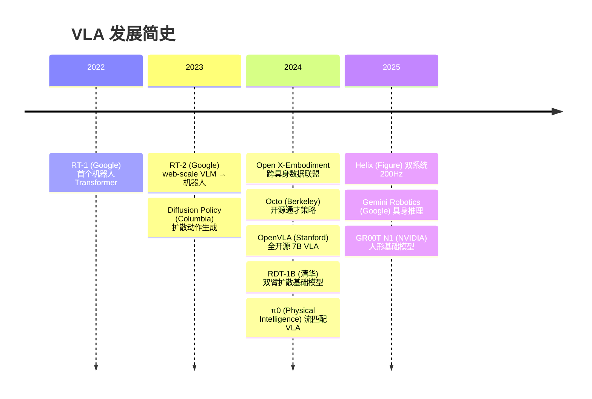

# 01 | VLA 基础概念

## 什么是 VLA

**VLA（Vision-Language-Action）** 将视觉感知、语言理解和动作控制统一到一个模型中。输入图像/视频和自然语言指令，输出机器人动作（关节角度、末端位姿、夹爪开合等），是具身智能（Embodied Intelligence）的核心方向。

## 问题形式化

给定观测 \(o_t\)（图像 + 语言指令 + 本体感知）和历史信息，VLA 模型需要输出动作 \(a_t\)：

\[
\pi(a_t \mid o_t, \mathcal{H}_{t-1}) = \text{VLA}(I_t, \ell, s_t, \mathcal{H}_{t-1})
\]

其中：

- \(I_t\)：当前视觉观测（RGB / RGB-D / 点云）
- \(\ell\)：语言指令（如"拿起桌上的红色杯子"）
- \(s_t\)：本体感知（关节角度、末端位姿、夹爪状态）
- \(\mathcal{H}_{t-1}\)：历史观测 - 动作序列（可选）

## 发展脉络

## 核心表征空间

### 视觉表征

| 方法 | 代表模型 | 特点 |
|------|---------|------|
| ViT 特征 | SigLIP (OpenVLA), DINOv2 (Octo) | 全局语义 + 局部细节 |
| CLIP 嵌入 | RT-2, π0 (PaliGemma) | 视觉 - 语言对齐，强语义 |
| 3D 点云 | 3D Diffusion Policy | 空间几何信息 |

### 动作表征

| 方法 | 代表工作 | 特点 |
|------|---------|------|
| 连续回归 | RT-1/2 | 直接输出数值，简单快速 |
| 离散 token | RT-2 (PalM-E), VQ-VLA | 复用 LLM token 预测能力 |
| 扩散去噪 | Diffusion Policy, RDT | 逐步去噪，高质量多模态分布 |
| 流匹配 | π0, FlowPolicy | 比扩散更快，适合高频控制 |
| 直接连续 | Helix | 跳过 tokenization，输出电机信号 |

### 语言表征

- **指令编码**：通过预训练 LLM/VLM 编码为 embedding
- **多粒度**：从短指令到多步任务描述
- **grounding**：语言概念与视觉物体/空间关系对齐

## 与相关领域的关系

| 领域 | 与 VLA 的关系 |
|------|---------------|
| **VLM (Vision-Language Model)** | VLA 的感知基础；VLM 提供视觉 - 语言理解和常识推理 |
| **LLM (Large Language Model)** | 提供语言理解、任务分解、规划能力 |
| **Imitation Learning** | VLA 最常见的训练范式；行为克隆是主力方法 |
| **RL (Reinforcement Learning)** | 用于 VLA 后训练微调，提升泛化和鲁棒性 |
| **Embodied AI** | VLA 是具身智能的核心技术栈之一 |

## 关键问题

1. **泛化**：新物体、新场景、新指令 → 零样本/少样本适应
2. **实时性**：大模型推理延迟 vs 控制频率需求（>10Hz）
3. **数据效率**：机器人数据采集成本高，数据量远小于视觉/语言
4. **跨具身**：不同机器人形态之间的策略迁移
5. **长序列**：多步骤任务的误差累积与稳定性

## Acknowledgement

- [VLA Survey (2025)](https://vla-survey.github.io/)
- [10 Open Challenges for VLA (AAAI 2025)](https://arxiv.org/abs/2511.05936)
