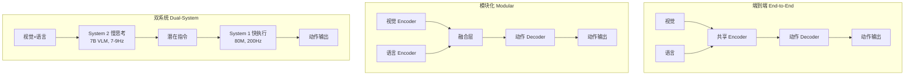

# 02 | VLA 架构范式

## 三大架构范式

### 端到端架构

视觉+语言+动作在同一模型中联合推理，通常基于预训练 VLM 扩展。

| 模型 | VLM 骨干 | 动作输出 | 参数 |
|------|---------|---------|------|
| RT-2 | PaLI-X / PaLM-E | 离散 token 回归 | 55B |
| OpenVLA | Llama-2 7B + SigLIP + DINOv2 | 连续回归 | 7B |
| π0 | PaliGemma 3B + 流匹配专家 | 流匹配连续值 | 3B |

**优点**：表征统一，端到端优化；**缺点**：推理慢（1-10Hz），难以高频控制。

### 模块化架构

视觉编码器、语言模型、动作解码器独立设计，通过中间表征桥接。

| 模型 | 视觉 | 语言 | 动作 | 参数 |
|------|------|------|------|------|
| Octo | DINOv2 | Gemma (可选) | 扩散 Transformer | 27-93M |
| RDT-1B | SigLIP | T5-XXL | 扩散 Transformer | 1.2B |
| GR00T N1 | 视觉编码器 | 语言模块 | 动作模块 | — |

**优点**：灵活组合、轻量高效；**缺点**：模块间信息传递可能损失。

### 双系统架构

模仿人脑快慢系统：System 2 慢思考（VLM，低频推理）→ System 1 快执行（轻量网络，高频控制）。

**代表：Figure Helix (2025)**

- **System 2**：7B VLM，7-9 Hz，负责场景理解、任务规划
- **System 1**：80M 交叉注意力头，200 Hz，将潜在指令实时转换为电机信号
- 关键技巧：训练时引入 temporal offset 模拟部署延迟

**优点**：解耦推理/控制频率，兼顾智能与实时；**缺点**：系统复杂，双模型需协同训练。

## 核心组件设计

### 视觉编码器

| 编码器 | 特点 | 使用模型 |
|--------|------|---------|
| **SigLIP** | 强视觉-语言对齐，ViT 架构 | OpenVLA, RDT-1B |
| **DINOv2** | 强视觉表征，自监督 | Octo |
| **CLIP** | 经典多模态对齐 | RT-2, 早期工作 |
| **PaliGemma** | 原生 VLM 视觉编码器 | π0 |

趋势：**多编码器融合**（OpenVLA 同时使用 SigLIP + DINOv2）以兼顾语义和细节。

### 语言模型骨干

| 骨干 | 参数 | 特点 |
|------|------|------|
| Llama-2 | 7B | OpenVLA 选型，生态成熟 |
| Gemma | 2B | Octo 选型，轻量高效 |
| PaLI-X | 55B | RT-2 选型，超大规模 |
| Gemini | — | Gemini Robotics，原生多模态 |
| Qwen | — | Qwen-VLA，中文友好 |

### 动作解码器

| 方法 | 推理步数 | 延迟 | 代表工作 |
|------|---------|------|---------|
| 连续回归 | 1 | 低 | RT-1/2, OpenVLA |
| 离散 token | 1 | 低 | RT-2 (PaLM-E 模式) |
| 扩散去噪 | 10-50 | 中 | Diffusion Policy, RDT |
| 流匹配 | 5-10 | 中低 | π0, FlowPolicy |
| 连续输出 | 1 | 极低 | Helix System 1 |

## 推理频率对比

| 模型 | 推理频率 | 适用场景 |
|------|---------|---------|
| RT-2 | 1-3 Hz | 桌面操作，低频控制 |
| OpenVLA | 1-5 Hz | 通用操作 |
| π0 | 10-50 Hz | 高频操作（叠衣、装袋） |
| RDT-1B | ~381 Hz | 双臂高速操作 |
| Helix | 200 Hz (System 1) | 人形全身控制 |

## Acknowledgement

- [VLA Survey: A Survey on Vision-Language-Action Models](https://vla-survey.github.io/)
- [Helix: A VLA Model for Generalist Humanoid Control](https://www.figure.ai/news/helix)
