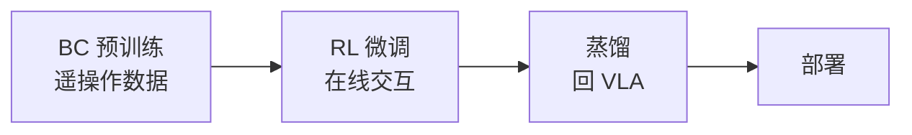
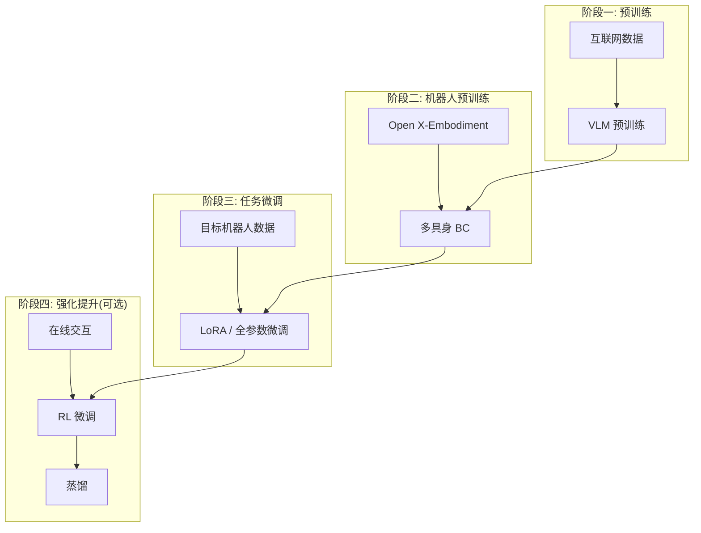

# 05 | VLA 训练范式

## 模仿学习（Behavior Cloning, BC）

VLA 最主要的训练范式：从人类遥操作演示中学习观测→动作的映射。

### 数据来源

| 方法 | 设备 | 典型场景 |
|------|------|---------|
| 遥操作（Teleop） | ALOHA, Franka, 力反馈手柄 | 双臂操作、精细任务 |
| 示教（Kinesthetic） | 手把手拖动机械臂 | 简单轨迹 |
| 自主采集 + 人工纠正 | 机器人自主执行 + 人干预 | 大规模高效采集 |

### BC 的局限

- **分布偏移（Distribution Shift）**：测试时微小误差累积导致状态偏离训练分布
- **上限受限于演示质量**：无法超越人类演示水平
- **长序列退化**：误差随序列长度指数级放大

> 解决方向：Action Chunking（Diffusion Policy）、历史条件、RL 微调

## RL 微调（Reinforcement Fine-tuning）

2024-2025 年重要趋势：BC 预训练后用 RL 微调提升泛化和鲁棒性。

### 典型工作流

### 关键工作

| 工作 | 会议 | 核心方法 |
|------|------|---------|
| **ConRFT** | RSS 2025 | Consistency Policy 一致性正则化 + RL 微调 |
| **VLA-RFT** | OpenReview 2025 | VLA + RL Fine-Tuning 统一框架 |
| **RL-VLA** | 清华 2025 | 系统实证 RL 对 VLA 泛化的作用 |

### RL 对 VLA 的增益（RL-VLA 结论）

- **目标泛化**：未见物体的操作成功率显著提升
- **视觉鲁棒性**：光照、背景变化下更稳定
- **在原本零成功率的任务上取得突破**

参考：[Awesome-VLA-Post-Training](https://github.com/AoqunJin/Awesome-VLA-Post-Training)

## Sim-to-Real 迁移

### 主流技术

| 技术 | 说明 |
|------|------|
| **领域随机化（DR）** | 仿真中随机化视觉/物理参数，迫使模型学鲁棒表征 |
| **渐进式迁移** | 先仿真 → 仿真 + 真实混合 → 纯真实 |
| **3D 资产渲染** | 高质量 3D 场景用于训练视觉 backbone |

### 代表系统

- **NVIDIA Isaac Sim**：GR00T N1 的仿真训练平台
- **SIM2REAL VLA**（OpenReview 2025）：专门研究 VLA 的仿真到现实迁移

## 多具身训练（Multi-Embodiment）

### 统一动作空间

| 方法 | 代表 | 特点 |
|------|------|------|
| 归一化映射 | RDT-1B | 所有动作归一化到 [-1, 1] |
| 相对偏移 | RT-X | 动作表示为相对当前位置的偏移 |
| 统一 token 空间 | RT-2 | 连续→离散 token，跨机器人统一 |

### 关键发现

- 多具身预训练 + 目标机器人微调 **显著优于** 仅目标机器人训练
- 更多样的训练机器人 → 更好的泛化（数据多样性定律）

## 训练流程总览

## Acknowledgement

- [ConRFT: Reinforced Fine-tuning for VLA](https://arxiv.org/abs/2502.05450)
- [RL-VLA (清华实证研究)](https://arxiv.org/abs/2503.11411)
- [Awesome-VLA-Post-Training](https://github.com/AoqunJin/Awesome-VLA-Post-Training)
