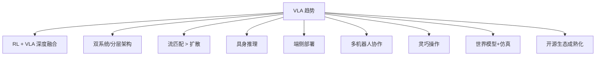

# 07 | VLA 开源生态与趋势

## 开源模型

| 模型 | 参数 | 许可证 | 仓库 |
|------|------|--------|------|
| **OpenVLA** | 7B | Apache 2.0 | [github.com/openvla/openvla](https://github.com/openvla/openvla) |
| **Octo** | 27-93M | MIT | [octo-models.github.io](https://octo-models.github.io/) |
| **RDT-1B** | 1.2B | MIT | [huggingface.co/robotics-diffusion-transformer/rdt-1b](https://huggingface.co/robotics-diffusion-transformer/rdt-1b) |
| **GR00T N1** | — | 开源 | [developer.nvidia.com/isaac/gr00t](https://developer.nvidia.com/isaac/gr00t) |
| **π0** | 3B | 部分开源 | HuggingFace 部分权重 |
| **CogACT** | — | 开源 | [cogact.github.io](https://cogact.github.io/) |

## 训练与推理框架

### LeRobot（HuggingFace）

最完善的端到端开源机器人学习库。

- **功能**：训练、数据集管理、评估、部署一体化
- **预训练模型**：提供多个预训练策略可供直接使用
- **数据集**：内置多个标准数据集
- **GitHub**：[github.com/huggingface/lerobot](https://github.com/huggingface/lerobot)

### NVIDIA Isaac 生态

| 组件 | 用途 |
|------|------|
| **Isaac Sim** | 高保真仿真环境，物理渲染 |
| **Isaac Lab** | 基于 Isaac Sim 的 RL 训练框架 |
| **Isaac Gym** | 高性能物理仿真 |

### 其他框架

| 框架 | 说明 |
|------|------|
| **robomimic / robosuite** | Stanford 操作学习与仿真框架 |
| **Drake** | MIT/丰田 机器人动力学与控制 |
| **MuJoCo** | Google DeepMind 物理仿真引擎 |
| **Diffusion Policy 代码** | [diffusion-policy.cs.columbia.edu](https://diffusion-policy.cs.columbia.edu/) |

## 论文与资源合集

| 资源 | 链接 | 内容 |
|------|------|------|
| **Awesome-VLA-Papers** | [GitHub](https://github.com/Psi-Robot/Awesome-VLA-Papers) | VLA 论文系统综述 |
| **Awesome-Robotics-Diffusion** | [GitHub](https://github.com/showlab/Awesome-Robotics-Diffusion) | 扩散/流匹配策略汇总 |
| **Awesome-VLA-Post-Training** | [GitHub](https://github.com/AoqunJin/Awesome-VLA-Post-Training) | VLA 后训练方法汇总 |
| **jonyzhang2023/awesome-embodied-vla** | [GitHub](https://github.com/jonyzhang2023/awesome-embodied-vla-va-vln) | 具身 VLA 大汇总 |

---

## 关键挑战

### 1. 数据稀缺与质量

机器人数据采集成本远高于视觉/语言数据。高质量遥操作 vs 低成本自主采集的权衡是核心瓶颈。

### 2. 泛化与鲁棒性

新物体、新场景、光照变化仍导致显著性能下降。实验室性能 vs 野外部署的 gap 仍然巨大。

### 3. 长序列任务

动作误差随序列累积，多步任务完成率远低于单步。需要更好的时序建模和错误恢复机制。

### 4. 实时推理

大模型推理延迟（VLM 级别）与机器人控制频率需求（>10Hz，精细控制 >100Hz）的矛盾。

### 5. 评估标准化

不同论文的真实世界评估协议不统一，结果难以直接比较。

### 6. 具身迁移

不同机器人形态之间的策略迁移仍很困难，需要大量目标机器人数据。

### 7. 安全与可解释性

VLA 的黑盒特性在物理世界中带来安全隐患，需要更好的可解释性和安全保障。

---

## 未来趋势（2025+）

| 方向 | 说明 | 代表工作 |
|------|------|---------|
| **RL + VLA** | BC→RL 微调成为标准流程 | ConRFT, VLA-RFT, RL-VLA |
| **双系统** | 快慢系统解耦推理与控制 | Helix, GR00T N1 |
| **流匹配优先** | 更少的采样步数，更快的推理 | π0, FlowPolicy |
| **具身推理** | 从感知→动作扩展到感知→推理→规划→动作 | Gemini Robotics |
| **端侧部署** | 轻量化 VLA 跑在边缘设备 | pi0-small, Gemini On-Device |
| **多机器人协作** | 单机器人→多机器人协调 | Helix zero-shot |
| **灵巧操作** | 高自由度手部的精细 VLA | — |
| **世界模型** | 更真实仿真，更大规模仿真数据 | Isaac Sim 4.x |

## AAAI 2025 十大开放挑战

来自 [10 Open Challenges Steering the Future of VLA](https://arxiv.org/abs/2511.05936)：

1. 数据效率
2. 跨具身迁移
3. 长序列任务规划
4. 安全与鲁棒性
5. 实时推理延迟
6. 持续学习与适应
7. 多模态融合策略
8. 评估标准化
9. 人机协作
10. 可解释性

## Acknowledgement

- [LeRobot](https://github.com/huggingface/lerobot)
- [VLA Survey (2025)](https://vla-survey.github.io/)
- [10 Open Challenges for VLA](https://arxiv.org/abs/2511.05936)
