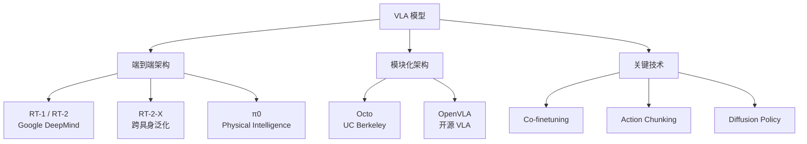

# VLA（视觉 - 语言 - 动作）

视觉 - 语言 - 动作模型（Vision-Language-Action Models），将视觉感知、语言理解和动作控制统一到一个模型中，是具身智能和机器人控制的核心方向。

## 知识框架

## 经典论文

### RT 系列

- [RT-1: Robotics Transformer for Real-World Control (2022)](https://arxiv.org/abs/2212.06817)
- [RT-2: Vision-Language-Action Models (2023)](https://arxiv.org/abs/2307.15818)
- [Open X-Embodiment & RT-X (2024)](https://arxiv.org/abs/2310.08864)

<iframe src="https://www.youtube.com/embed/2t70iT6j5wc" allowfullscreen></iframe>

### Octo / OpenVLA

- [Octo: An Open-Source Generalist Robot Policy (2024)](https://arxiv.org/abs/2405.12213)
- [OpenVLA: An Open-Source Vision-Language-Action Model (2024)](https://arxiv.org/abs/2406.09246)

<iframe src="https://www.youtube.com/embed/08MXM_qS2ho" allowfullscreen></iframe>

### π0 (Physical Intelligence)

- [π0: A Vision-Language-Action Flow Model (2024)](https://arxiv.org/abs/2410.24164)

### Diffusion Policy

- [Diffusion Policy: Visuomotor Policy Learning via Action Diffusion (2023)](https://arxiv.org/abs/2303.04137)
- [3D Diffusion Policy (2024)](https://arxiv.org/abs/2403.03954)

## 学习资源

- [VLA 论文合集](https://github.com/Shuwn-Yuan/Awesome-VLA)
- [具身智能综述](https://github.com/embodied-generalist/awesome-embodied-generalist)

