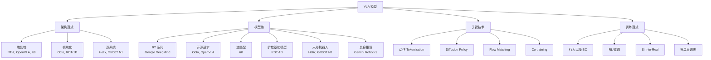

# VLA（视觉 - 语言 - 动作）

视觉 - 语言 - 动作模型（Vision-Language-Action Models），将视觉感知、语言理解和动作控制统一到一个模型中，是具身智能和机器人控制的核心方向。

## 知识框架

## 章节

| 章节 | 内容 |
|------|------|
| [01 基础概念](./01-Foundations.md) | VLA 定义、问题形式化、发展脉络、表征空间、与相关领域关系 |
| [02 架构范式](./02-Architectures.md) | 端到端 vs 模块化 vs 双系统、视觉/语言/动作编码器设计、推理频率 |
| [03 模型族](./03-Models.md) | RT-1/2/2-X、Octo、OpenVLA、π0、RDT-1B、Helix、GR00T N1、Gemini Robotics 等详解 |
| [04 关键技术](./04-Techniques.md) | 动作 Tokenization、扩散策略、流匹配、协同训练、语言/图像条件 |
| [05 训练范式](./05-Training.md) | BC → RL 微调流程、Sim-to-Real、多具身训练、训练管线总览 |
| [06 数据集与评测](./06-Datasets.md) | Open X-Embodiment、DROID、BridgeData V2、LIBERO、CALVIN、评估框架 |
| [07 开源生态与趋势](./07-Ecosystem.md) | 开源模型与框架、论文合集、关键挑战、未来趋势 |

## 经典论文速览

| 模型 | 年份 | 机构 | 核心贡献 |
|------|------|------|---------|
| RT-1 | 2022 | Google | 首个机器人 Transformer |
| RT-2 | 2023 | Google | web-scale VLM → 机器人 |
| Diffusion Policy | 2023 | Columbia | 扩散动作生成 |
| RT-X | 2024 | Google + 33 机构 | 跨具身 co-fine-tuning |
| Octo | 2024 | Berkeley | 开源通才策略 |
| OpenVLA | 2024 | Stanford/Berkeley | 全开源 7B VLA |
| RDT-1B | 2024 | 清华 | 双臂扩散基础模型 |
| π0 | 2024 | Physical Intelligence | 流匹配 VLA |
| Helix | 2025 | Figure AI | 双系统 200Hz |
| GR00T N1 | 2025 | NVIDIA | 人形基础模型 |
| Gemini Robotics | 2025 | Google | 具身推理 VLA |

## 学习资源

- [VLA Survey (2025)](https://vla-survey.github.io/)
- [Awesome-VLA-Papers](https://github.com/Psi-Robot/Awesome-VLA-Papers)
- [VLA 论文合集](https://github.com/Shuwn-Yuan/Awesome-VLA)
- [具身智能综述](https://github.com/embodied-generalist/awesome-embodied-generalist)
- [Awesome-VLA-Post-Training](https://github.com/AoqunJin/Awesome-VLA-Post-Training)
- [LeRobot (HuggingFace)](https://github.com/huggingface/lerobot)
