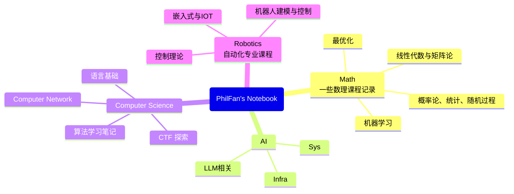

如果你觉得这个笔记本对你有用的话，不妨动动小手点一个 star！

## About this Notebook

笔记本的主要内容如下

```mermaid
mindmap
    root(PhilFan's Notebook)
        Math<br/> 一些数理课程记录
            线性代数与矩阵论
            概率论、统计、随机过程
            最优化
            机器学习
        AI<br/> 
            LLM相关
            Infra
            Sys
        Computer Science<br/>
            语言基础
            Computer Network
            算法学习笔记
            CTF 探索
        Robotics<br/>自动化专业课程
            控制理论
            嵌入式与IOT
            机器人建模与控制
```
